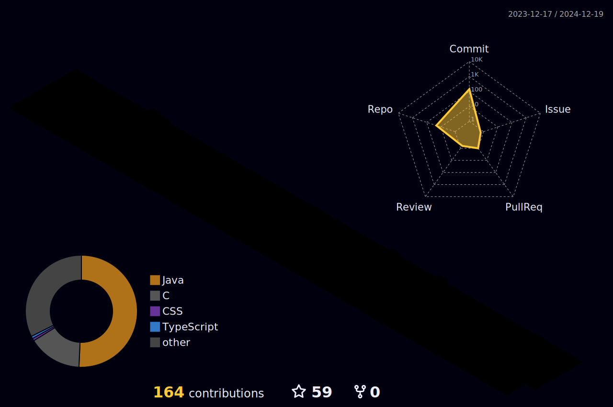

 

    

<h1 align="center">𝐇𝐞𝐥𝐥𝐨, &lt;𝚌𝚘𝚍𝚎𝚛𝚜/&gt;!</h1>
 

    

<h3 align="left">👩‍💻 About Me</h3>

I am a Java developer with 1.5 years of experience in the field of enterprise application development. My journey in IT began with learning Java and has since expanded to working with frameworks and tools such as Spring, Maven, Docker, and more.

🔭 I have been involved in the development and maintenance of enterprise applications.

📚 I have completed courses and trainings on Java and the Spring Framework.

⚡ In my free time, I explore new technologies and tools to enhance my skills.

Currently, I am a second-year student BSTU named after V.G. Shukhov, pursuing a degree in Software Engineering (9.03.04). My academic background and practical experience have provided me with a solid foundation in software development, allowing me to contribute effectively to various projects.

<h3 align="left">🛠 Technologies:</h3>

    

    
  
        
         
         
         
         
         
         
         
         
         
         
        
         
         
         
        
        
         
         
         
         
         
         
         
         
         
         
         
        
        
        
        
    

<h3 align="left">🔥 LeetCode :</h3>

  

<h3 align="left">🔥 Stats :</h3>

    
    

### 𝚂𝚑𝚘𝚠 𝚜𝚘𝚖𝚎 ❤️ 𝚋𝚢 𝚜𝚝𝚊𝚛𝚛𝚒𝚗𝚐 𝚜𝚘𝚖𝚎 𝚘𝚏 𝚝𝚑𝚎 𝚛𝚎𝚙𝚘𝚜𝚒𝚝𝚘𝚛𝚒𝚎𝚜!

